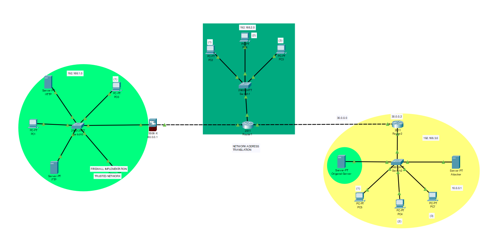
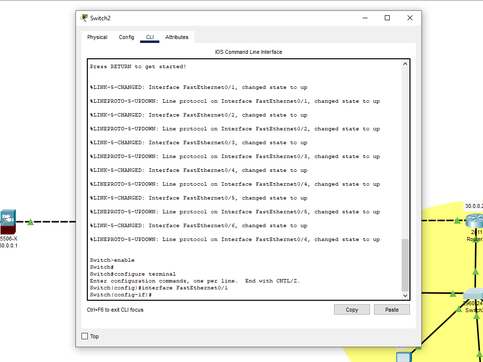
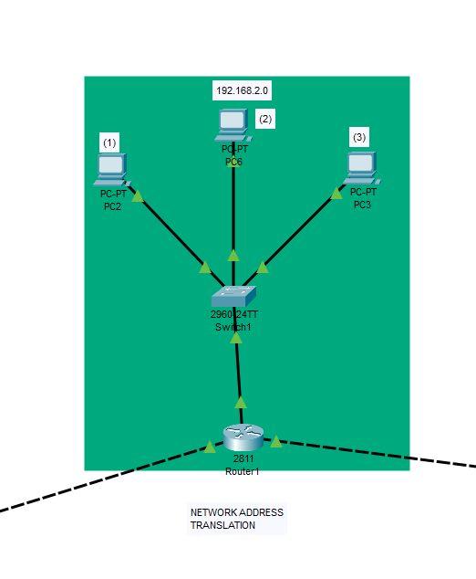
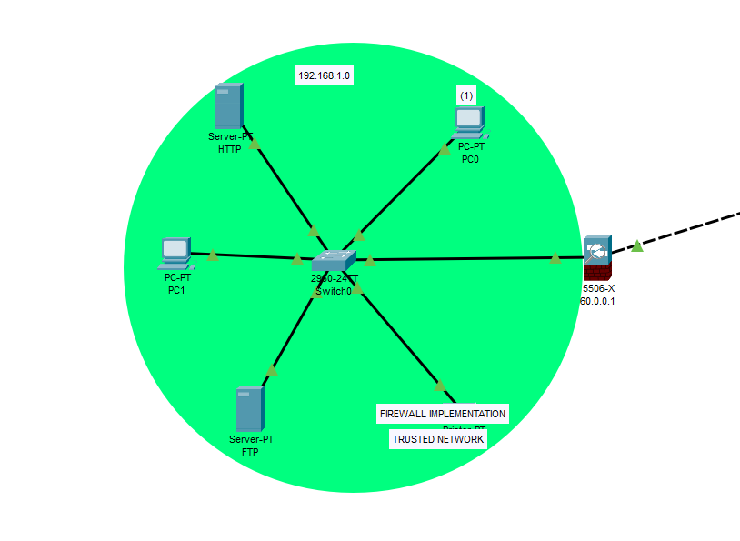
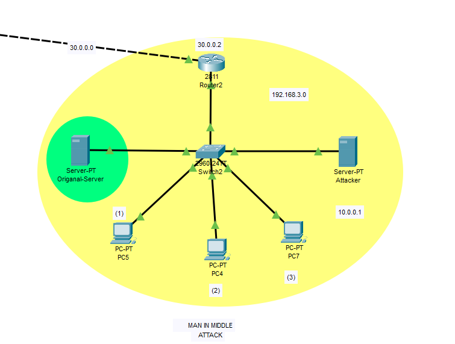

# 👨🏻‍💻 Network Security (Vulnerabilities, Threats and Countermeasures)

This project aims to provide an overview of network security, including common vulnerabilities and threats, as well as countermeasures that can be taken to secure a network.
Installation
To use this project, you will need to install Cisco Packet Tracer. You can download the software from the official Cisco website, and installation instructions are provided in the software package.
# 📈 Usage

This project is intended to serve as an educational resource for those interested in learning about network security. The project covers topics such as common network vulnerabilities (e.g. denial-of-service attacks, malware, and social engineering), common network threats (e.g. unauthorized access, data theft, and phishing), and countermeasures that can be taken to secure a network (e.g. firewalls, intrusion detection systems, and access controls).

## Here are some brief notes on how a network works:

  A network is a collection of devices that are connected to each other through a communication medium, such as cables or wireless signals.
   Devices on a network can communicate with each other by sending packets of data over the network.
   Each device on a network has a unique identifier, known as an IP address, which is used to route data to the correct destination.
   Networks can be classified based on their size and scope, such as local area networks (LANs), wide area networks (WANs), and the internet.
   Networks can be secured using a variety of techniques, including firewalls, encryption, access controls, and network monitoring tools.
# ⭐️ Complete Project look like

# 👉🏻 DHCP

# 👉🏻 Network Address Translation

# 👉🏻 Firewall Implementation Trusted Network

# 👉🏻 Man in The Middle Attack 

# 🛈 More Info about all these points.

Know more about DHCP..

 
DHCP (Dynamic Host Configuration Protocol) is a network protocol used to automatically assign IP addresses, subnet masks, default gateways, and other network configuration information to network devices.

Here's how DHCP works on a network:

    A device connects to the network and requests an IP address.
    The DHCP client broadcasts a DHCPDISCOVER message to the network.
    DHCP servers on the network receive the broadcast and respond with a DHCPOFFER message, containing an IP address and other network configuration information.
    The client chooses an offer and sends a DHCPREQUEST message to the chosen DHCP server, requesting the offered configuration.
    The server responds with a DHCPACK message, confirming the configuration and providing a lease time for the assigned IP address.
    The client configures its network settings based on the received DHCPACK message.

DHCP can help simplify network administration by automating the process of assigning IP addresses and other network configuration information. This can be particularly useful in large networks where manually configuring each device can be time-consuming and error-prone.

Know more about Network Address Translation...

 
 Network Address Translation (NAT) is a process used to translate public IP addresses into private IP addresses or vice versa. NAT is often used in networks that have a limited number of public IP addresses available, as it allows multiple devices on a network to share a single public IP address.

Here's how NAT works:

    A device on the private network sends a packet to a public IP address on the internet.
    The NAT device receives the packet and changes the source IP address to the public IP address of the NAT device.
    The NAT device forwards the packet to the internet.
    The internet device receives the packet and sends a response back to the public IP address of the NAT device.
    The NAT device receives the response and changes the destination IP address to the private IP address of the original sender.
    The NAT device forwards the response to the original sender on the private network.

NAT can provide an additional layer of security to a network by hiding the private IP addresses of devices behind a single public IP address. However, it can also cause issues with certain network protocols that rely on unique IP addresses for each device, such as some online gaming and peer-to-peer applications.

Know more about Firewall Implementation Trusted Network...

 
A firewall is a network security device that monitors and controls incoming and outgoing network traffic based on predetermined security rules. Implementing a firewall can help protect a network from unauthorized access and other security threats.

In a trusted network configuration, the firewall is typically configured to allow traffic from known, trusted sources while blocking traffic from unknown or untrusted sources. This configuration can help prevent outside attackers from gaining access to the network, while still allowing authorized users and devices to communicate freely within the network.

To implement a firewall in a trusted network configuration, you would typically follow these steps:

    Identify the trusted sources on your network, such as specific IP addresses or ranges, and create rules to allow traffic from these sources.
    Configure the firewall to block traffic from all other sources by default.
    Monitor the network traffic and adjust the firewall rules as needed to ensure that legitimate traffic is not blocked while still maintaining security.

It's important to note that a firewall alone may not be sufficient to fully protect a network from all security threats. Other security measures, such as strong passwords, regular software updates, and user education, should also be implemented to create a comprehensive security strategy.

Know more about Man in The Middle Attack...

 
A Man-in-the-Middle (MitM) attack is a type of cyber attack where an attacker intercepts communication between two parties, such as a user and a website or two network devices, in order to eavesdrop, steal data, or manipulate the communication.

Here's how a Man-in-the-Middle attack works:

    The attacker intercepts the communication between the two parties, often by inserting themselves into the communication path or by compromising a network device.
    The attacker then listens to or modifies the communication, depending on their objectives. For example, they may steal login credentials, inject malware or spyware, or modify data.
    To prevent detection, the attacker may use various techniques, such as spoofing IP addresses or using fake SSL certificates.

MitM attacks can be particularly dangerous because the attacker can intercept sensitive information, such as passwords or financial data, without the victim knowing that their communication has been compromised. To prevent MitM attacks, users and organizations should take measures such as using strong encryption and authentication methods, regularly checking SSL certificates, and keeping software and devices up to date with the latest security patches.

⚡️ This project was created by **Rohit Chaudhary, Naman, Vishnu Kumar**.

# Contact
If you have any questions or feedback about this project, please contact at Namansharma2718@gmail.com | rohitcoc245@gmail.com.
